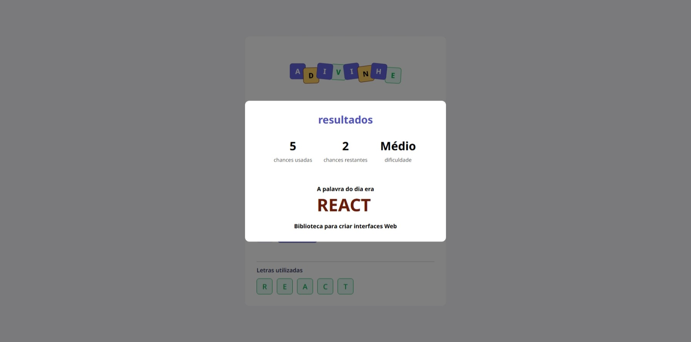

# Guessing Game

Projeto de adivinhacao de palavras desenvolvido durante o curso Full Stack da Rocketseat, com implementacoes adicionais feitas por mim.

Autor: Lucas Moura

## Sobre

A proposta do jogo e descobrir a palavra com base em uma dica, tentando letra por letra.
A interface mostra:

- progresso de tentativas
- letras ja utilizadas
- letras corretas reveladas na palavra
- resultado final de vitoria ou derrota em modal

## Preview

## Funcionalidades

- Sorteio de palavra ao iniciar o jogo
- Campo de palpite com validacoes
- Bloqueio de letras repetidas
- Contagem de acertos com base nas letras encontradas
- Limite de tentativas baseado no tamanho da palavra + margem
- Reinicio manual com confirmacao
- Modal de fim de jogo com estatisticas
- Bloqueio do input apos finalizar a partida

## Implementacoes alem da base do curso

- Controle de estado da partida (score, letras usadas e resultado)
- Logica de fim de jogo (win/lose) com reset controlado
- Componente de resultado com tipagem de status
- Calculo dinamico de tentativas maximas
- Exibicao dinamica das letras descobertas na palavra

## Tecnologias

- React
- TypeScript
- Vite
- CSS Modules

## Como executar localmente

### Pre-requisitos

- Node.js instalado
- Gerenciador de pacotes (npm, yarn ou pnpm)

### Passos

1. Clone o repositorio.
2. Instale as dependencias com `npm install`.
3. Rode o projeto com `npm run dev`.
4. Abra o endereco exibido no terminal (normalmente http://localhost:5173).

## Scripts disponiveis

- `npm run dev`: inicia o servidor de desenvolvimento
- `npm run build`: gera build de producao
- `npm run preview`: visualiza build localmente
- `npm run lint`: executa lint

## Estrutura principal

- `src/App.tsx`: logica principal do jogo
- `src/utils/words.ts`: palavras e dicas
- `src/components`: componentes de interface
- `src/components/Modal/GameResult`: modal de fim de jogo

## Atualizacao da palavra do dia

Atualmente a palavra esta em arquivo local.
Para atualizar diariamente, basta editar o conteudo de `src/utils/words.ts` e subir um novo commit.

## Licenca

Projeto para fins de estudo.
